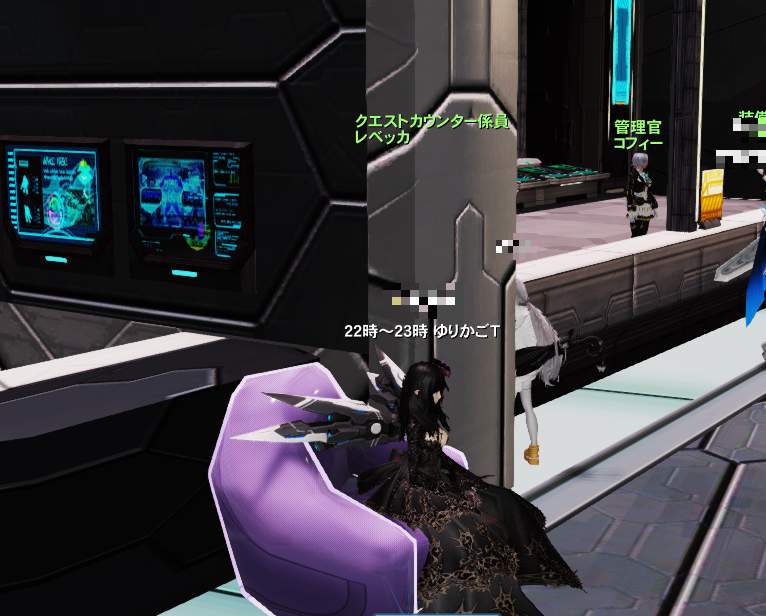

# 「闇のゆりかごトリガー (ゆりかごT)」の進行の方法 (主催者向け)

## 0. 目次

## 1. 概要

旧PSO2 で今でも人気のコンテンツである「闇のゆりかごトリガー」(通称：ゆりかごT) の私なりの主催の流れについて説明しています。

**あくまで私のやり方であり、強制するものではありません。** どなたかの参考になれば幸いです。

## 2. 対象の読者

以下の読者を想定しています。

- 旧PSO2 をある程度プレイしており、クエストトリガーについて既に理解をしている方、かつ
- ゆりかごTの主催をこれからしてみようと考えておられる方、または慣れていない方

## 3. 事前の準備

### 3.1 「いつから、どのぐらいの時間 (あるいは枚数) だけやるか」を決める

#### 3.1.1 いつから？

日については、週末の方が人が集まりやすいようですが、筆者の鯖では平日でもそれなりに人が集まりますので、筆者はそこら辺はこだわってはいません。

時刻については、筆者の鯖では、**だいたい 21時 または 22時 から開始する主催者が多い** ようです。

> [!NOTE]
> 旧PSO2 では過疎化が進んでおり、基本的にプレイヤー数があまり多くありませんので、**参加者を集めるためには十分な宣伝時間を設けることが必須です。**
> 
> NGSをメインにプレイしていて旧PSO2には何かあった時しか来ない、という方も少なからずおられるので、尚更です。
> 
> なので、例えば **「今トリガーを貼ったから、良かったから来てね♪」** とやっても、フルメンバー (12人) に達するまでに相当の時間 (数十分～数時間) がかかることは覚悟してください。
> 
> **「1時間後に貼るよ!」** でもちょっと厳しいと思います。
>
> ちなみに私なら最低でも2時間以上は宣伝時間を設けます。

> [!WARNING]
> **既に宣伝がされているトリガーと時間帯が重なりそうな日時の開催は避けましょう。**
>
> 理由は、前述と同じく旧PSO2の過疎化が進んでいるためです。
>
> 筆者の鯖では、たとえ、十分な宣伝時間を設けたとしても、参加希望者の数は12人以上かつ24人未満、がせいぜいです。
> 
> そのような状況なので、複数のトリガーが貼られてしまうと、少なくともどちらかのトリガーの参加人数が大きく不足する可能性が高くなり、主催者にとっても参加者にとってもいいことはありませんし、プレイヤー間のトラブルにもつながる可能性があります。
>
> 既に別の主催者の方が既に宣伝を出している場合は、参加者の方の休憩時間なども考慮して、やや時間を離して開催するのがいいと思います。

> [!WARNING]
> **「2の日」(毎月 1日、2日、3日、21日、22日、23日) は NGS をプレイする方が多くなるためか参加者が減る傾向がある**ので、私は2の日の主催は避けるようにしています。

#### 3.1.2 どのぐらいの時間 (あるいは 枚数)？

これは主催の都合次第ですが、以下の理由により **私は長くとも2時間を超えないようにしています。**

- チームツリーのバフ (通称：チムキ) の効果時間が2時間である。
- 2時間を超えると集中力が落ち始めるプレイヤーが多い。

> [!TIP]
> 「2時間だと次の日の仕事に差し支えるので1時間で抜けたい」という方も結構おられるので、最初から1時間にした方が人が集まりやすいこともあるようです。

> [!WARNING]
> たまに、「主催が力尽きるまで貼り続ける」あるいは「参加者が〇〇人以下になるまで続ける」という主催の方もおられます。
> 
> 私の経験上ではありますが、そういった方法の場合、終盤の参加者が激減してしまい中途半端に人数が残ってしまったりして、参加者の気分的にも効率的でもあんまりよろしくないことが多かったように思います。
> 
> なので、私の場合は時間、あるいは枚数をきっちり決めておくことにしています。

### 3.2 宣伝をする

前述のように十分な宣伝をしなければ参加者は集まりませんので、宣伝は必要です。

一番よく使われている方法は、以下の例のように、クエストカウンター前でオンラインステータスを表示して放置しておくことです。(通称：看板)

宣伝時間は長いほど効果的ではありますが、宣伝時間の分だけ主催者の拘束時間も長くなりますので、そこら辺は主催者次第です。

複数アカウントを持っている主催者の方は、24時間前から看板を出していることもあるようです。

> [!TIP]
> 参加してくれそうなフレンドが多いようなら、フレンドメッセージに開催日時を書いておくのも効果的です。普段は NGS の住人の方にも伝わりますし。
>
> チームチャットやグループチャットで告知するのも効果的だと思います。

## 4. 当日の進行について

### 4.1 進行の流れの概要

筆者の鯖では、以下のような流れが各主催や参加者の間で暗黙の了解となっており、同じ流れで開催した方が混乱なく進行できると思います。

1. 開始日時になったらトリガーを貼る。
2. 攻略を開始する。
3. 攻略が終わったら **できるだけ速やかに** 次のトリガーを貼る。
4. 鑑定または休憩をする。
5. 次の攻略を開始する。
6. 3 から繰り返す。

> [!WARNING]
> このドキュメントの執筆時点で、筆者の鯖ではゆりかごTは非常に人気のコンテンツで、合計12人の枠を参加希望者が取り合う席取りゲームとなっています。
>
> なので、**参加者が一番神経を使うのは「如何にして席取りゲームに勝利するか」** で、**主催者がトリガーを貼るタイミングを読めない、というのが参加者にとっては一番困ります。**
> 
> 参加希望者が席取りゲームを始めてしまうと、参加希望者はチャットログも読めない状態になります。
> 可能な限り速やかに次のトリガーを貼りましょう。
>
> もし、次に貼るトリガーがもうない (つまり前回に貼ったトリガーが最後だった) 場合には、前回の時点で「これが最終です」と宣言しておくべきです。

### 4.2 主催のお仕事

トリガーを貼る以外にも主催の仕事は結構あります。

#### 4.2.1 開催を中止するかどうかの判断と対処

こうならないことがベストなのですが、たまには中止せざるを得ない場合もあります。

##### ケースA) 参加者の人数が足りない場合

ゆりかごTというのはクリアが目的ではなく、以下の多くのエネミーを倒すか、が目的です。**「収入≒ドロップアイテム数≒討伐エネミー数」** なので。
特に**PSEバーストの場合は「同時に再POPするエネミーの数は参加者数と同じ」** という性質があるため、参加者が多いことは重要です。

私なりの概ねの目安ですが、最初に8人以上いて、それ以降人数が減らない見込みであれば、そのまま続行します。

参加人数が8人を割った場合、私なら中止を決定します。

クリアだけなら4人程度でもできますが、非常に時間がかかりますので、収入に見合わないと考える人が多いでしょう。

とはいえ、その時貼ってしまったトリガーが1枚もったいないので、最初のボスであるゼッシュレイダまでの雑魚をひたすら倒して、ゼッシュレイダがPOPしたら各自クエストを中断してお開き、ということにすることが多いです。

##### ケースB) 開催中に人気の緊急クエストが発生した (あるいは発生する) 場合

私が主催していた場合、ではありますが、ゆりかごT開催前、あるいは開催中に以下の緊急クエストが発生した場合、ゆりかごTの中止あるいは開始時刻の延期を検討します。

- 闇のゆりかご
- 憎悪に歪む原初の闇 (通称：憎悪 [ぞうお])
- 艦破訓練：終の慟哭 (通称：慟哭 [どうこく])

闇のゆりかごは、正に開催するトリガーと同じコンテンツなので、参加者が割れることが予想されます。
私であれば、緊急の終了後にトリガーを貼るか、もし残り時間的にその余裕がなければ、トリガーの中止を宣言します。

憎悪の場合、発生することが分かった時点で、即、トリガーの中止を決定します。
憎悪を待ち望んでいるプレイヤーは非常に多く、緊急予定時刻の1時間前から準備をして、緊急が終わった後も疲労困憊でトリガー参加どころじゃない、という方が多いようです。

慟哭は、いくつかのレアドロップが見込めるため、ゆりかごTより優先する人もいると思われます。
私なら、緊急ゆりかごの場合と同様に延期または中止を検討します。~~ていうか、私も慟哭行きたい。~~

> [!TIP]
> 旧PSO2 では緊急クエストは15分前からアナウンスされますが、もし PSO2es と連動していれば、PSO2es を起動してみることにより、緊急クエストの発生を1時間前に知ることが出来ます。
>
> トリガー開催1時間前に PSO2es を起動して、緊急クエストの有無や種類を確認しておくといいでしょう。

#### 4.2.2 全員集合してからテレポータを起動するための工夫

参加者全員がテレポータ付近にいない状況でテレポータを起動して突入

## 5. 当日の準備

アイテムパック、倉庫の空きをたくさん作っておく
ブーストアイテムの確認
トリガーの確認

### 5.1 宣伝をする

開催日時が決まったら、次は宣伝をします。

見かける方も多いと思いますが、よく使われている宣伝方法は、「クエストカウンター前でオンラインステータスを表示して放置する」です。

チームやグループチャットに所属している方は、そちらで宣伝するのも効果的でしょう。

> [!TIP]
> 宣伝時間は長い方が効果的です。

