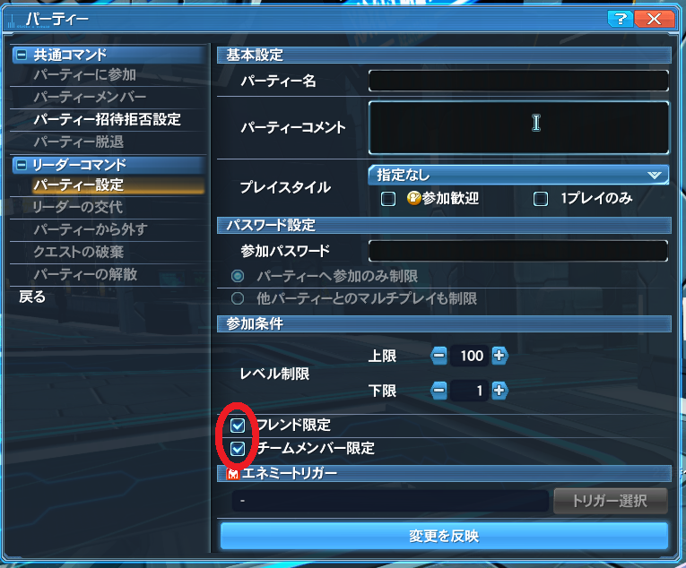

# 「闇のゆりかごトリガー (ゆりかごT)」の進行の方法 (主催者向け)

## 0. 目次

- [1. 概要](#1-%E6%A6%82%E8%A6%81)
- [2. 対象の読者](#2-%E5%AF%BE%E8%B1%A1%E3%81%AE%E8%AA%AD%E8%80%85)
- [3. まずは当日の進行について](#3-%E3%81%BE%E3%81%9A%E3%81%AF%E5%BD%93%E6%97%A5%E3%81%AE%E9%80%B2%E8%A1%8C%E3%81%AB%E3%81%A4%E3%81%84%E3%81%A6)
    - [3.1 進行の流れの概要](#31-%E9%80%B2%E8%A1%8C%E3%81%AE%E6%B5%81%E3%82%8C%E3%81%AE%E6%A6%82%E8%A6%81)
    - [3.2 主催のお仕事](#32-%E4%B8%BB%E5%82%AC%E3%81%AE%E3%81%8A%E4%BB%95%E4%BA%8B)
        - [3.2.1 開催を中止するかどうかの判断と対処](#321-%E9%96%8B%E5%82%AC%E3%82%92%E4%B8%AD%E6%AD%A2%E3%81%99%E3%82%8B%E3%81%8B%E3%81%A9%E3%81%86%E3%81%8B%E3%81%AE%E5%88%A4%E6%96%AD%E3%81%A8%E5%AF%BE%E5%87%A6)
        - [3.2.2 できるだけ、全員集合してからテレポータを起動する](#322-%E3%81%A7%E3%81%8D%E3%82%8B%E3%81%A0%E3%81%91%E5%85%A8%E5%93%A1%E9%9B%86%E5%90%88%E3%81%97%E3%81%A6%E3%81%8B%E3%82%89%E3%83%86%E3%83%AC%E3%83%9D%E3%83%BC%E3%82%BF%E3%82%92%E8%B5%B7%E5%8B%95%E3%81%99%E3%82%8B)
        - [3.2.3 最後の周回の決定とお知らせ](#323-%E6%9C%80%E5%BE%8C%E3%81%AE%E5%91%A8%E5%9B%9E%E3%81%AE%E6%B1%BA%E5%AE%9A%E3%81%A8%E3%81%8A%E7%9F%A5%E3%82%89%E3%81%9B)
- [4. 事前の準備](#4-%E4%BA%8B%E5%89%8D%E3%81%AE%E6%BA%96%E5%82%99)
    - [4.1 「いつから、どのぐらいの時間 (あるいは枚数) だけやるか」を決める](#41-%E3%81%84%E3%81%A4%E3%81%8B%E3%82%89%E3%81%A9%E3%81%AE%E3%81%90%E3%82%89%E3%81%84%E3%81%AE%E6%99%82%E9%96%93-%E3%81%82%E3%82%8B%E3%81%84%E3%81%AF%E6%9E%9A%E6%95%B0-%E3%81%A0%E3%81%91%E3%82%84%E3%82%8B%E3%81%8B%E3%82%92%E6%B1%BA%E3%82%81%E3%82%8B)
        - [4.1.1 いつから？](#411-%E3%81%84%E3%81%A4%E3%81%8B%E3%82%89)
        - [4.1.2 どのぐらいの時間 (あるいは 枚数)？](#412-%E3%81%A9%E3%81%AE%E3%81%90%E3%82%89%E3%81%84%E3%81%AE%E6%99%82%E9%96%93-%E3%81%82%E3%82%8B%E3%81%84%E3%81%AF-%E6%9E%9A%E6%95%B0)
    - [4.2 宣伝をする](#42-%E5%AE%A3%E4%BC%9D%E3%82%92%E3%81%99%E3%82%8B)
- [5. 当日の準備](#5-%E5%BD%93%E6%97%A5%E3%81%AE%E6%BA%96%E5%82%99)
    - [5.1 持ち物・倉庫などの準備](#51-%E6%8C%81%E3%81%A1%E7%89%A9%E5%80%89%E5%BA%AB%E3%81%AA%E3%81%A9%E3%81%AE%E6%BA%96%E5%82%99)
    - [5.2 看板を出す](#52-%E7%9C%8B%E6%9D%BF%E3%82%92%E5%87%BA%E3%81%99)
    - [5.3 (チームに所属していれば) チームツリーのバフをもらう](#53-%E3%83%81%E3%83%BC%E3%83%A0%E3%81%AB%E6%89%80%E5%B1%9E%E3%81%97%E3%81%A6%E3%81%84%E3%82%8C%E3%81%B0-%E3%83%81%E3%83%BC%E3%83%A0%E3%83%84%E3%83%AA%E3%83%BC%E3%81%AE%E3%83%90%E3%83%95%E3%82%92%E3%82%82%E3%82%89%E3%81%86)
    - [5.4 主催PTを編成する](#54-%E4%B8%BB%E5%82%ACpt%E3%82%92%E7%B7%A8%E6%88%90%E3%81%99%E3%82%8B)
    - [5.5 定刻になったらトリガーを貼る](#55-%E5%AE%9A%E5%88%BB%E3%81%AB%E3%81%AA%E3%81%A3%E3%81%9F%E3%82%89%E3%83%88%E3%83%AA%E3%82%AC%E3%83%BC%E3%82%92%E8%B2%BC%E3%82%8B)
- [6. 注意事項](#6-%E6%B3%A8%E6%84%8F%E4%BA%8B%E9%A0%85)
    - [6.1 主催PTの設定について](#61-%E4%B8%BB%E5%82%ACpt%E3%81%AE%E8%A8%AD%E5%AE%9A%E3%81%AB%E3%81%A4%E3%81%84%E3%81%A6)
- [7. おまけ](#7-%E3%81%8A%E3%81%BE%E3%81%91)
    - [7.1 用意しておいた方がいいショートカットワード](#71-%E7%94%A8%E6%84%8F%E3%81%97%E3%81%A6%E3%81%8A%E3%81%84%E3%81%9F%E6%96%B9%E3%81%8C%E3%81%84%E3%81%84%E3%82%B7%E3%83%A7%E3%83%BC%E3%83%88%E3%82%AB%E3%83%83%E3%83%88%E3%83%AF%E3%83%BC%E3%83%89) 
    - [7.2 PSEバーストの仕様について (ご存じでない方のために)](#72-pse%E3%83%90%E3%83%BC%E3%82%B9%E3%83%88%E3%81%AE%E4%BB%95%E6%A7%98%E3%81%AB%E3%81%A4%E3%81%84%E3%81%A6-%E3%81%94%E5%AD%98%E3%81%98%E3%81%A7%E3%81%AA%E3%81%84%E6%96%B9%E3%81%AE%E3%81%9F%E3%82%81%E3%81%AB)
    - [7.3 主催観点でどういう参加者がありがたいか](#73-%E4%B8%BB%E5%82%AC%E8%A6%B3%E7%82%B9%E3%81%A7%E3%81%A9%E3%81%86%E3%81%84%E3%81%86%E5%8F%82%E5%8A%A0%E8%80%85%E3%81%8C%E3%81%82%E3%82%8A%E3%81%8C%E3%81%9F%E3%81%84%E3%81%8B)

## 1. 概要

本ドキュメントでは、旧PSO2 で今でも人気のコンテンツである「闇のゆりかごトリガー」(通称：ゆりかごT) の筆者なりの主催の流れについて説明しています。

- **あくまで筆者のやり方の解説であり、けっして他のプレイヤーに強制するものではありません。**
- 主催の仕事に関する解説であり、**闇のゆりかごの攻略そのものには触れていません。**

本ドキュメントがどなたかの参考になれば幸いです。

## 2. 対象の読者

本ドキュメントは、以下の読者を想定しています。

- 旧PSO2 をある程度プレイしており、クエストトリガーについて既に理解をしている方、かつ
- ゆりかごTへの参加経験が何度かある方、かつ
- ゆりかごTの主催をこれからしてみようと考えておられる方、または慣れていない方

もし、ゆりかごTへの参加経験がない場合は、何度か他の方の主催するゆりかごTに参加してだいたいの流れを理解してから、本ドキュメントをお読みくださるようお勧めします。

## 3. まずは当日の進行について

### 3.1 進行の流れの概要

筆者の鯖では、以下のような流れが各主催や参加者の間で暗黙の了解となっており、同じ流れで開催した方が混乱なく進行できると思います。

1. 開始日時になったらトリガーを貼る。
2. 攻略を開始する。
3. 攻略が終わったら **できるだけ速やかに** 次のトリガーを貼る。
4. 鑑定または休憩をする。
5. 次の攻略を開始する。
6. 3 から繰り返す。

> [!WARNING]
> 本ドキュメントの執筆時点で、筆者の鯖ではゆりかごTは非常に人気のコンテンツで、合計12人の枠を参加希望者が取り合う席取りゲームとなっています。
>
> なので、**参加希望者が一番神経を使うのは「如何にして席取りゲームに勝利するか」** であり、**「主催者がトリガーを貼るタイミングを読めない」というのが参加希望者にとっては一番困ります。**
> 
> いったん席取りゲームを始めてしまうと、参加希望者はチャットログを読むどころではない状態になりますので、そういうタイミングで例えば主催が「あと2分ぐらいしたら次のトリガーを貼ります」とか発言したとしても、気づかずに席取りゲームを続ける参加希望者が多いでしょう。
>
> 参加希望者のストレスを減らすためにも、**可能な限り速やかに次のトリガーを貼りましょう。**
>
> もし、次に貼るトリガーがもうない (つまり前回に貼ったトリガーが最後だった) 場合には、前回の時点で「これが最終です」と宣言しておくべきです。

### 3.2 主催のお仕事

トリガーを貼る以外にも主催の仕事は結構あります。

#### 3.2.1 開催を中止するかどうかの判断と対処

中止という事態にならないことがベストなのですが、たまには中止せざるを得ない場合もあります。

##### ケースA) 参加者の人数が足りない場合

ゆりかごTというのはクリアが目的ではなく、如何に多くのエネミーを倒すか、が目的です。**「収入≒ドロップアイテム数≒討伐エネミー数」** なので。
特に**PSEバーストの場合は「同時に再POPするエネミーの数は参加者数と同じ」** という性質があるため、参加者が多ければその分PSEバースト中のドロップの数は増える、つまり収入が増えます。

しかし、参加者が集まらない場合は致し方ありません。無い袖は振れない、絵に描いた餅、というやつです。

 

筆者なりの概ねの目安ですが、最初の周に8人以上いて、それ以降の周に人数が減らない見込みであれば、そこそこのペースで進めれると判断し、そのまま続行します。

そして、参加人数が8人を割った場合、中止を決定します。

最後までクリアするだけなら4人程度でもできますが、非常に時間がかかりますので、収入に見合わないと考える人が多いでしょう。

とはいえ、その時貼ってしまった1枚のトリガーがもったいないので、最初のボスであるゼッシュレイダまでの雑魚をひたすら倒して、ゼッシュレイダがPOPしたら各自クエストを破棄してお開き、ということにすることが多いです。

##### ケースB) 開催中に人気の緊急クエストが発生した (あるいは発生予定であることが判明した) 場合

ゆりかごT開催前、あるいは開催中に以下の何れかの緊急クエストが発生した場合、ゆりかごTの中止あるいは開始時刻の延期を検討します。

- 闇のゆりかご
- 憎悪に歪む原初の闇 (通称：憎悪 [ぞうお])
- 艦破訓練：終の慟哭 (通称：慟哭 [どうこく])
- 虚無より睨む原初の闇 (通称：普通の原初、あるいは虚無 [きょむ])

闇のゆりかごは、正に開催しようとしているトリガーと同じコンテンツなので、参加者が割れることが予想されます。
そのため、緊急の終了後にトリガーを貼るか、もし残り時間的にその余裕がなければ、トリガーの開催中止を決定します。

憎悪の場合、発生することが分かった時点で、即、トリガーの開催中止を決定します。
何故ならば、憎悪を待ち望んでいるプレイヤーは非常に多く、緊急予定時刻の1時間前から準備をして、緊急が終わった後も疲労困憊でトリガー参加どころじゃない、という方が多いからです。

虚無や慟哭は、いくつかのレアドロップが見込めるためにゆりかごTより優先して参加する人もいると思われますので、緊急ゆりかごの場合と同様に延期または中止を検討します。~~ていうか、私も虚無や慟哭行きたい。~~

何れの場合にせよ、トリガーの開催を延期または中止にする場合は、その旨をその場にいる参加希望者に白チャで広報しましょう。主催のオンラインステータスにも以下の例のように簡単に書いておくと参加希望者の手間がある程度省けます。

- 「緊急後 ゆりかごT」
- 「21:40～ ゆりかごT」
- 「緊急憎悪 ゆりかご中止」

> [!TIP]
> 旧PSO2 では緊急クエストは15分前からアナウンスされますが、もし PSO2es と連動していれば、PSO2es を起動してみることにより、緊急クエストの発生を1時間前に知ることが出来ます。
>
> トリガー開催1時間前に PSO2es を起動して、緊急クエストの有無や種類を確認しておくといいでしょう。

#### 3.2.2 できるだけ、全員集合してからテレポータを起動する

クエスト中に発生するエマージェンシートライアルでPOPするエネミーの数や、PSEバーストで同時に再POPするエネミーの数は、クエストを受注している人数ではなく、そのエリアにいる人数によるようです。
そのため、テレポータ前にまだ全員集まっていない状態でテレポータを起動すると突入直後に少ない数のエネミーしかPOPしないので、その分収入は減ります。

なので、少しでも収入を増やすためには、**できるだけ全員そろってからテレポータを起動した方がいいでしょう。**

 

とはいえ、ゆりかごTはドロップの鑑定などに非常に時間がかかるため、主催が期待するよりテレポータへの到着が遅れる参加者もそこそこいます。

なので、主鑑定中の参加者への催促？や、参加者が不足している場合の追加募集のために、**主催は他の参加者より最後にキャンプシップへ入るべきです。**

しかしそれでは現在テレポータ前に何人集合中かが主催にはわからないので、筆者は以下のような工夫をしています。

1) 最初にトリガーを貼る前に、誰かお手伝いをしてくれる人とPTを組む。
2) お手伝いの方には (鑑定などが終わり次第) 先にテレポータ前に降りてもらい、テレポータ付近の人数を逐次PTチャットで主催に教えてもらう。(「5」とか「11」とか数字のみでもOK)
3) 主催は、以下の何れかになったら、「そろそろ開始するので急いでください」などを白チャで呼びかけた後、自分もテレポータ前に降りる。
    - 鑑定ショップ前に人がいなくなった場合
    - テレポータ付近の人数が多くなってきた場合
    - (事前に鑑定時間を決めている場合は) 鑑定時間が経過した場合

> [!TIP]
> 人数のカウントは、「周囲のキャラクター」を表示して、その人数 + 1 (自分の分) を見ればわかります。
> 
> あと、人数をカウントする際に、テレポータ前のエリアの参加者がPOP？する地点が見える位置に陣取っているとカウントが楽です。

#### 3.2.3 最後の周回の決定とお知らせ

これは特に難しいことはありませんが、これを忘れると、もう最後の周回も終わってしまったのに参加者の方が席取りゲームに行ってしまうことがありますので、忘れてはいけません。

 

あらかじめ何枚だけやると決めていたなら、最後のトリガーを貼った後と最終周のテレポータを起動する前に「これが最終周です」と参加者に知らせます。

 

終了予定時刻を決めていた場合には、トリガーを貼るときに **「あと2週回れるか？」** を考え、無理そうなら、前述と同様にトリガーを貼った後とテレポータ起動前に「これが最終周です」と参加者に知らせます。

ちょっと厄介なのは、「まだ2周回れる」と予想していたのに、PSEバーストが長引いたなどの理由でその周を最後にせざるを得ない場合です。その場合は「これを最終周にする」という判断をした時点でその旨を参加者に白チャで呼びかけます。

もちろん、その時は戦闘中であることが多く、発言に気がつかない参加者の方もおられる可能性が高いので、何度か呼びかけておくといいでしょう。主催がチャットを入力するのにも時間がかかるので、そのためのショートカットワードをあらかじめ登録しておくと便利です。

## 4. 事前の準備

前述のような流れで進行することを前提として、どのような準備が事前に必要かを説明します。

### 4.1 「いつから、どのぐらいの時間 (あるいは枚数) だけやるか」を決める

#### 4.1.1 いつから？

日については、週末の方が人が集まりやすいようです。しかし筆者の鯖では平日でも (満員御礼とはならないこともありますが) それなりに人が集まりますので、筆者はそこら辺はこだわってはいません。

時刻については、筆者の鯖では、**だいたい 21時 または 22時 から開始する主催者が多い** ようです。

> [!NOTE]
> 旧PSO2 では過疎化が進んでおり、基本的にプレイヤー数があまり多くありませんので、**参加者を集めるためには十分な宣伝時間を設けることが必須です。**
> 
> NGSをメインにプレイしていて旧PSO2には何かあった時しか来ない、という方も少なからずおられるので、尚更です。
> 
> なので、例えば **「今トリガーを貼ったから、良かったから来てね♪」** とやっても、フルメンバー (12人) に達するまでに相当の時間 (数十分以上) がかかることは覚悟してください。それどころか、時間がかかりすぎて途中で脱退者が出たりしてそもそも十分な人数が集まらない可能性もあります。
> 
> **「1時間後に貼るよ!」** でもちょっと厳しいと思います。
>
> ちなみに筆者なら最低でも2時間以上は宣伝時間を設けます。

> [!WARNING]
> **既に宣伝がされているトリガーと時間帯が重なりそうな日時の開催は避けましょう。**
>
> 理由は、前述と同じく旧PSO2の過疎化が進んでいるためです。
>
> 筆者の鯖では、たとえ、十分な宣伝時間を設けたとしても、参加希望者の数は12人以上かつ24人未満、がせいぜいです。
> 
> そのような状況なので、一度に複数のトリガーが貼られてしまうと、少なくともどちらかのトリガーの参加人数が大きく不足する可能性が高くなります。
> これは、主催者にとっても参加者にとってもいいことはありませんし、プレイヤー間のトラブルにもつながる可能性があります。
>
> 既に別の主催者の方が既に宣伝を出している場合は、参加者の方の休憩時間なども考慮して、やや時間を離して開催するのがいいと思います。

> [!WARNING]
> **「2の日」(毎月 1日、2日、3日、21日、22日、23日) は NGS をプレイする方が多くなるためか、旧PSO2のトリガーの参加者が減る傾向がある** ので、筆者は2の日の主催は避けるようにしています。

#### 4.1.2 どのぐらいの時間 (あるいは 枚数)？

これは主催の都合次第ですが、以下の理由により **筆者は長くとも2時間を超えないようにしています。**

- チームツリーのバフ (通称：チムキ) の効果時間が2時間である。
- 2時間を超えると集中力が落ち始めるプレイヤーが多い。

ちなみに、一周辺りの所要時間は、PSEバーストが全く起きなければ鑑定時間込みでも15分ぐらい、がっつりPSEバーストが起きれば鑑定時間込みで30分以上もあり得ます。

> [!TIP]
> 「2時間だと次の日の学業や仕事等に差し支えるので1時間で抜けたい (あるいは途中から参加したい)」という方も結構おられるので、最初から1時間にした方が参加希望者が集まりやすいこともあるようです。

> [!WARNING]
> たまに、「主催が力尽きるまで貼り続ける」あるいは「参加者が〇〇人以下になるまで続ける」という主催の方もおられます。
> 
> 筆者の経験上ではありますが、そういった方法の場合、途中で参加者が疲れた始めた頃に参加者の人数が激減してしまい中途半端に人数が残ってしまったりして、残った参加者の気分的にも効率的にもあんまりよろしくないことが多かったように思います。
> 
> なので、筆者の場合は「どれだけの時間 (あるいは枚数) だけやるか」をきっちり決めておくことにしています。

### 4.2 宣伝をする

前述のように、十分な宣伝をしなければ参加希望者は集まりませんので、宣伝は必要です。

一番よく使われている方法は、以下の例のように、クエストカウンター前でオンラインステータスを表示して放置しておくことです。(通称：看板)

宣伝時間は長いほど効果的ではありますが、宣伝時間の分だけ主催者の拘束時間も長くなりますので、どれだけ前から看板を出すかは主催者次第です。

複数アカウントを持っている主催者の方は、24時間前から看板を出していることもあるようです。

> [!TIP]
> 参加してくれそうなフレンドが多いようなら、フレンドメッセージに開催日時を書いておくのも効果的です。普段は NGS の住人の方にも伝わるので便利です。
>
> チームチャットやグループチャットで告知するのも効果的だと思います。

## 5. 当日の準備

当然、当日に準備することも多いです。

### 5.1 持ち物・倉庫などの準備

看板を出す前に、やれることは全部やっておきます。

まずは、アイテムパックと倉庫の空きを極力多く作っておきましょう。
主催は、他の参加者と違って、最初から最後まで参加しなければならず、しかもトリガー主にはレアドロ率UPのブーストがかかるそうなので、ドロップアイテム数は他の参加者より多くなる見込みだからです。

アイテムパックのアイテムのうち、ゆりかごTの最中に不要なものは倉庫に退避しておきましょう。

前述のような理由から、基本倉庫と、できればプレミアム倉庫も空っぽにしておくのがいいでしょう。
あと、可能なら拡張倉庫も空にしておくといいと思います。

以下のようなアイテムの所持も忘れずに。

- (ブーストアイテムをアイテムパックに持つのであれば) 十分な数のブーストアイテム
- (マグの餌をアイテムパックに持つのであれば) マグの餌
- 十分な数の **闇のゆりかごトリガー**

> [!TIP]
> 目安として、アイテムパックの容量を目いっぱい拡張しておいたとしても、PSEバーストが発生すると、大抵の場合、アイテムパックにドロップアイテムが入りきれずに基本倉庫に格納されるようになります。
> 
> PSEバーストが長引くと、ドロップアイテムが基本倉庫にも入りきれずにプレミアム倉庫に格納されるようになることはよくあります。
> 
> そして非常に稀ではありますが、PSEバーストが非常に長引いた場合は、ドロップアイテムがプレミアム倉庫にすら入りきれずに拡張倉庫にも格納されるようになることもあります。そのような状況は筆者も数度しか経験していませんが、フルメンバー (12人) であるにもかかわらず攻略の所要時間が25分を超えたと言えば、どれだけPSEバーストが長引いたかお分かりになる方もおられるでしょう。

### 5.2 看板を出す

持ち物の準備が終わったら、次は看板を出します。

看板を出している時間の分プレイ時間が削られますが、我慢して看板を出しましょう。

> [!WARNING]
> 他の手段でも宣伝したとしても、看板を出さないという選択肢はありません。
>
> 何故ならば、**看板を出さないと、他の主催さんが同じ日程で (ゆりかごではないかもしれませんが) トリガーを開催してしまうかもしれない** からです。

### 5.3 (チームに所属していれば) チームツリーのバフをもらう

開始時刻の前になったら、(チームに所属していれば) チームツリーのバフをもらいに行きましょう。攻撃力UPでもレアドロ率UPでもそこはお好みでいいと思います。

次項で説明する主催PTの編成作業も考慮すると、遅くてもトリガーを貼る時刻の10分前にはバフをもらいに行った方がいいと思います。

### 5.4 主催PTを編成する

チームツリーのバフをもらったら、主催PTを編成します。

主催PTの編成は絶対必要、というわけではありませんが、[前述の理由](#322-%E3%81%A7%E3%81%8D%E3%82%8B%E3%81%A0%E3%81%91%E5%85%A8%E5%93%A1%E9%9B%86%E5%90%88%E3%81%97%E3%81%A6%E3%81%8B%E3%82%89%E3%83%86%E3%83%AC%E3%83%9D%E3%83%BC%E3%82%BF%E3%82%92%E8%B5%B7%E5%8B%95%E3%81%99%E3%82%8B)から、あらかじめPTを組んでおいた方がスムーズに進行できます。

あと、単純に、PTを組むとPT人数に応じてレアドロ率UPなどのブーストがかかって収入の増加が見込めますし、PTメンバーの装備などによってはPP管理も楽になります。

### 5.5 定刻になったらトリガーを貼る

ここまで準備が出来て定刻になったら、いよいよゆりかごTの開始です。

最初にトリガーを貼る前には白チャで一言「これからトリガーを貼ります」など声をかけるといいでしょう。

進行については[前述の内容](#3-%E3%81%BE%E3%81%9A%E3%81%AF%E5%BD%93%E6%97%A5%E3%81%AE%E9%80%B2%E8%A1%8C%E3%81%AB%E3%81%A4%E3%81%84%E3%81%A6)を参照してください。

## 6. 注意事項

### 6.1 主催PTの設定について

主催PTの人数が4人に満たない場合、トリガーを貼ったときに一般参加者が主催PTに加入してくることがあります。
一般参加者が加入してきても主催が気にしないなら別に構わないのですが、よく知らない一般参加者に主催PTに入って欲しくない場合は、あらかじめパーティーの設定で以下の項目をONにしておくといいでしょう。

- フレンド限定
- チームメンバー限定

## 7. おまけ

### 7.1 用意しておいた方がいいショートカットワード

チャットでトリガーの進行によく使う文言をショートカットワードに登録しておくと、チャットをいちいち入力しなくて済むので、スムーズに進行できます。
筆者が登録しているのは大体以下のようなものです。

- 最初のトリガーの開始のあいさつ (参加していたいだいてありがとうございます、など)
- 注意事項の説明 (PSEバーストが発生したら一か所にまとまってください、など)
- 終了予定時刻 (あるいは貼るトリガーの枚数) の説明 (〇〇時に終了予定です、あるいは〇〇枚貼る予定です、など)
- 開始の宣言 (テレポータを起動します、など)
- 鑑定中の参加者への催促？ （そろそろ開始します。キャンプシップへ急いでください、など）
- 最後のトリガーを貼ったときの宣言 (今貼ったトリガーが最後です、など)
- 最終周のテレポータ起動前のあいさつ (これから最終周です。おつきあいありがとうございました、など)
- 現在の周を最終周に変更する旨の告知 (次のトリガーを貼ると終了時刻を大幅に過ぎてしまうので、これを最終周にします、など)

> [!NOTE]
> だいたいの流れをつかんでおられればお分かりだと思いますが、最終周が終わった後は参加者の皆さんは慌しく退出していきますので、最後のあいさつの時間はテレポータ起動前に設けた方がいいでしょう。

### 7.2 PSEバーストの仕様について (ご存じでない方のために)

どちらかというと、一般参加者向けの内容ですが、一応。

ゆりかごTでの収入はPSEバースト次第と言っても過言ではありません。
PSEバーストが発生するかどうか、そしてどれだけPSEバーストが続くかは運任せの要素が大きいのですが、いざ発生した時にはやっぱりがっつり稼ぎたいので、その辺の仕様について解説しようと思います。

#### [PSEバースト中は、エネミーはプレイヤーの周囲に再POPする]

NGS の PSE バーストでは、エネミーはある固定地点の周囲に再POPしますが、旧PSO2では **各プレイヤーの周囲に** 再POPします。

なので、プレイヤーがある地点に集まった方が、エネミーのPOP地点も予測しやすく、そこを狙って範囲攻撃でエネミーを一掃できるので、より早くエネミーを倒せます。

逆に、プレイヤーが散らばっていると、それぞれのプレイヤーの周囲にばらばらにエネミーが再POPするため、倒すのに時間がかかってしまいます。

#### [PSEバーストの延長回数は無制限]

NGS ではPSEバーストの延長 (アンコール) が最大で2回発生し得ますが、旧PSO2 では、理屈上では (「ワンモア」や「クロスバースト」などが) 無制限に発生し得ます。

その辺については、仮説ではあるものの [PSO2 攻略wiki のPSEに関する記事](https://pso2.swiki.jp/index.php?PSE#he9f8d3e) に書かれています。

要するに、PSEバーストしてる間も油断せずにエネミーを倒しましょう、ってことだと思います。多分。きっと。

~~まぁ、度を超すとPSEどころかアイテムパックだけでなく倉庫もバーストするわけですが~~

### 7.3 主催観点でどういう参加者がありがたいか

これもどちらかというと、一般参加者向けの内容です。
内容はあくまで筆者の主観です。

- PSEバーストが発生した際に集合地点のアナウンスをしてくれる方
- ボス討伐中に、雑魚エネミーがPOPが完全に枯れるまで、雑魚エネミーの殲滅に注力するか、あるいはボスへの攻撃を手加減して雑魚エネミーの殲滅を優先してくれる方。
- ゼッシュレイダのヘイトを取って、雑魚エネミーのPOP地点から引き離してくれる方
- 移動時に先行しすぎて最後尾を大きく引き離してPSEバースト時の集合に支障を来すようなことを絶対しない方

> [!TIP]
>
> ゆりかごTの目的は、**「どれだけ多くのドロップアイテムをGETするか」** であり、そのために気をつけなければならないのは、**「雑魚エネミーをどれだけ早く多く倒すか」** です。
>
> 雑魚エネミーを連続してたくさん倒せれば、PSEバーストも発生しやすくなります。
>
> なので、理想なのは **「全員あまり離れずに行動する」**、**「残っている雑魚エネミーを放置して進みすぎない」**、**「ボスを倒すことよりも、(必要ならボスを雑魚エネミーのPOP地点から引き離して) POPした雑魚エネミーを速やかに倒すことを優先する」**、のようなことだと筆者は考えます。
>
> にもかかわらず、現実のゆりかごTでは「PSEレベルが7でバースト寸前で」「雑魚エネミーがまだまだPOPしそうで」「それなのにボスが攻撃され続けてトドメが刺され、雑魚エネミーのPOPが止まってしまう」というのもよく見かけるのですが、そういうのは非常にもったいないと思うのです。
>
> まぁ、野良イベントでそこまで望むのは無理があるとは思っていますし、参加者のみなさんにもそれぞれのお考えがあるのだろうとは思いますが…
>
> ちなみに、緊急ゆりかごの場合だとまた話は違ってきて、**「30分間という受注可能時間内により多くの周回をした方が収入が高い」** と考える方も多いようで (確かにそれは否定できないのですが) 、トリガーの場合よりも更にタイムアタック的な攻略になっているようです。
