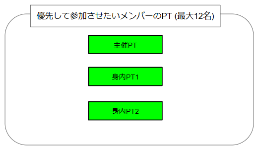

# 半固定ゆりかごTを実現する方法の例

## 0. 目次

## 1. 概要

> 親しい人たちとゆりかごTに行きたい。
>
> でも、野良募集はたくさん人が集まるから、入れなくて困る。
>
> じゃあ、自分でトリガーを用意して、固定メンバーでやろうか。
>
> でも固定メンバーだけだと人数が足りない。
>
> じゃあ、足りない分は野良募集する半固定にしよう。

…と考える人は結構いると思います。

でもそういう野良募集を見かけることはあまりありません。
多分ですが、半固定トリガーの編成がかなり面倒なのがその大きな要因のひとつだと思います。

本ドキュメントでは、半固定トリガーを編成する際の問題点と、その解決策の例について解説します。

前もって書いておきますが、**本ドキュメントで説明する例でもかなりの面倒さは残ります** ので、実用的かどうかは疑問が残るところです。

## 2. 本ドキュメントが対象とする読者

本ドキュメントは、以下のような読者を対象にしています。

- PSO2 で野良トリガーの主催経験がある方

## 3. 固定トリガーと参加パスワードの仕様 (おさらい)

まず、完全な固定トリガー (野良募集をせず仲間内のPTだけで実施するトリガー) の編成方法のおさらいから始めます。
この辺の仕様を既にご存じの方は読み飛ばして
[4. 半固定トリガーをどのように実現するか](#4-%E5%8D%8A%E5%9B%BA%E5%AE%9A%E3%83%88%E3%83%AA%E3%82%AC%E3%83%BC%E3%82%92%E3%81%A9%E3%81%AE%E3%82%88%E3%81%86%E3%81%AB%E5%AE%9F%E7%8F%BE%E3%81%99%E3%82%8B%E3%81%8B)
へお進みください。

とりあえず、トリガーを貼るPT (主催PT) と、主催が参加させたいPT (身内PT) がいくつかあり、それ以外の部外者のPTはシャットアウトしたい、という状況を考えます。

|  |
|:--|
 
固定PTを組むためには、主催PTのパーティー設定画面で参加パスワードを設定します。(俗に言う **「鍵をかける」** というやつです)

|  |
|:--|

参加パスワードを設定することにより、主催PTへ参加しようとすると以下のような画面が表示され、パスワードを知らない部外者は主催PTへ参加できなくなります。

|  |
|:--|

 

これで部外者の参加をシャットアウトできるでしょうか？

いいえ、これだけでは不十分です。

**「パーティーへの参加のみ制限」** が指定されているので、これでシャットアウトできるのは、主催PTそのものへの参加だけです。

部外者がパーティーの一覧から主催PTを選んで、**「別のパーティーとして参加」** を選択すると、そのパーティーが受けているクエスト (つまりゆりかごT) に参加できてしまいます。

|  |
|:--|

その結果として、タイミングによっては、以下のように、ゆりかごTの12人の枠内に身内PTが入れない可能性があります。

|  |
|:--|

 

部外者が主催PTと同じクエストに参加できないようにするためには、主催PTのパーティー設定画面で **「他パーティーとのマルチプレイも制限」** を指定する必要があります。

|  |
|:--|

この設定をすることにより、主催PTと同じクエストに参加しようとすると、やはりパスワード入力画面が表示され、パスワードを知らない限りクエストに参加できなくなります。

 

では、今度こそ部外者の参加をシャットアウトできるでしょうか？

いいえ、残念ながらそれでも不十分です。

主催PTで設定した **「他パーティーとのマルチプレイも制限」** の指定は、あくまでも「主催PTと同じクエストへの参加にはパスワードが必要となる」指定であって、以下のように、 **部外者PTが主催PT以外の身内PTと同じクエストに参加しようとする分には何ら障害とはなりません。**

|  |
|:--|

この問題への完全な対処方法は、 **(パーティーを組んでいる人もソロの人も含めて) 主催PTと身内全員がパーティー設定画面で (参加パスワードを設定した上で) 「他パーティーとのマルチプレイも制限」を指定する** ことです。

|  |
|:--|

この場合、主催PTのパーティー設定画面で設定するパスワードと、各身内PTのパーティー設定画面で設定するパスワードは、(ややこしいことに) 必ずしも一致する必要はありません。しかし、混乱を避けるために参加パスワードは統一しておくのが無難でしょう。

## 4. 半固定トリガーをどのように実現するか

PSO2でのトリガーへの鍵かけの仕組みを再確認したところで、改めて半固定トリガーをどのように実現するかを考えてみます。

### 4.1 アプローチその1) 固定トリガーを組んだ後で鍵を外す

この方法は手順としては簡単です。

1) 主催PTが鍵をかけた上でトリガーを貼る。
2) 身内PTがトリガーのクエストを受注する。(当然鍵もかける)
3) **主催PTとすべての身内PTが参加できたことを確認した上で**、主催PTと身内PTの鍵を外す。
4) 参加希望者に白チャで準備ができたことを広報する。

一見これで問題なさそうに見えます。過去にこの手順を実験的に実施した知人がいましたが、特に大きな問題は発生しませんでした。少なくとも外見上は。

この方法で問題となるのは以下の点です。

#### 問題点) 主催者と各身内PTのリーダーの負担が大きい

まず、「鍵をかけたり」「外したり」を、トリガーを貼る度にやらなければならないのが大変です。

完全な固定トリガーの場合は、各PTのパーティー設定画面で鍵をかける設定をしたらその後はパーティー設定画面をいじる必要はありません。
しかし、「鍵を外す」という手順が含まれているため、主催者を含めて固定メンバーのパーティーリーダーたちは、トリガーを貼る度にパーティー設定画面で鍵をかける設定をし直さなければなりません。

この負担は「トリガーを貼ってから一般参加者が参加可能になるまでのタイムラグ」にも反映されてしまうわけで、何の手順ミスもなかったとしても、30秒～1分程度は余分にかかっていた記憶があります。

### 4.2 アプローチ2) 一般参加者に開放するPTを1つだけ設ける

「パーティー設定を何度もいじらずに済む方法はないか」という方向で考えたのがこの方法です。ちなみにこの方法はまだ実施した実績がありません。

まず、固定メンバーのPTのうち、身内PTの1つを殿 (しんがり) PTと呼称し、一般参加者へは殿PTへの「別のパーティーとして参加」だけをできるようにするものとします。

通常は、パーティー設定というのは一度内容を設定したらその設定内容のまま変更しなくてもいいものなのですが、

手順3 の「主催PTとすべての身内PTが参加できたことを確認した上で」と

鍵をかけたり外したりというのは、落ち着いてやれば何でもない作業です。
しかし、周囲に椅子取り競争の開始を待ち受けている一般参加者たちがいる要る状況で、主催者と身内PTの各リーダーたちは迅速に間違いなく作業をしなければなりません。

パーティー設定画面でパーティー名を設定する.png
パーティー名を指定したトリガーの表示.png

