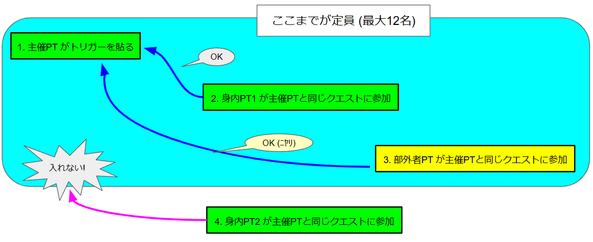
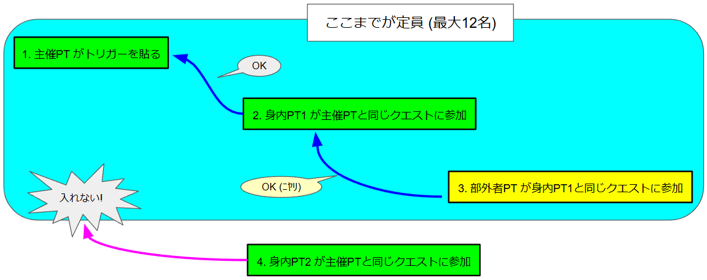
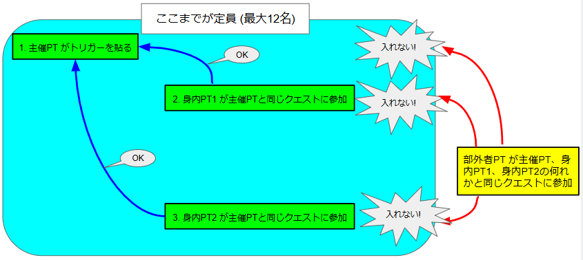

# ゆりかごTで半固定PTを実現する方法の一例

## 0. 目次

## 1. 概要

> 親しい人たちとゆりかごTに行きたい。
>
> でも、野良募集はたくさん人が集まるから、入れなくて困る。
>
> じゃあ、自分でトリガーを用意して、固定メンバーでやろう。
>
> でも固定メンバーだけだと人数が足りない。
>
> じゃあ、足りない分は野良募集する半固定PTにしよう。

…と考える人は結構いると思います。

でもそういう野良募集を見かけることはあまりありません。何故かというと、半固定PTの編成がかなり面倒なのが大きな要因のひとつだと思います。

本ドキュメントでは、半固定PTを編成する際の問題点と、その解決策の一例について解説します。

前もって書いておきますが、**最終的に説明する例でもかなりの面倒さは残ります** ので、実用的かどうかは疑問が残るところです。

## 2. 本ドキュメントが対象とする読者

本ドキュメントは、以下のような読者を対象にしています。

- PSO2 で野良トリガーの主催経験がある方

## 3. 半固定PTの編成が面倒な理由

### 3.1 固定PTと参加パスワードの仕様 (おさらい)

まず、完全な固定PT (野良募集をせず仲間内だけで組むPT) の編成方法のおさらいから始めます。
この辺の仕様を既にご存じの方は読み飛ばしてください。

まず、トリガーを貼るPT (主催PT) と、主催が参加させたいPT (身内PT) がいくつかあり、それ以外の部外者のPTはシャットアウトしたい、という状況を考えます。

固定PTを組むためには、まず、主催PTのパーティー設定画面で参加パスワードを設定します。

参加パスワードを設定することにより、主催PTへ参加しようとすると以下のようなパスワードの入力画面が表示され、パスワードを知らない部外者は主催PTへ参加できなくなります。

 

これで部外者の加入をシャットアウトできるでしょうか？

いいえ、これだけでは不十分です。

**「パーティーへの参加のみ制限」** が指定されているので、これでシャットアウトできるのは、主催PTそのものへの加入だけです。

部外者がパーティーの一覧から主催PTを選んで、**「別のパーティーとして参加」** を選択すると、そのパーティーが受けているクエスト (つまりゆりかごT) に参加できてしまいます。

その結果として、タイミングによっては、以下のように、ゆりかごTの12人の枠内に身内PTが入れない可能性があります。

 

部外者が主催PTと同じクエストに参加できないようにするためには、主催PTのパーティー設定画面で **「他パーティーとのマルチプレイも制限」** を指定する必要があります。

この設定をすることにより、主催PTと同じクエストに参加しようとすると、やはりパスワード入力画面が表示され、パスワードを知らなければクエストに参加できなくなります。

 

では、今度こそ部外者の加入をシャットアウトできるでしょうか？

いいえ、残念ながらそれでも不十分です。

主催PTで設定した **「他パーティーとのマルチプレイも制限」** の指定は、あくまでも「主催PTと同じクエストへの参加にはパスワードが必要となる」指定であって、以下のように、部外者PTが身内PTと同じクエストに参加しようとする分には何ら障害とはなりません。

この問題への完全な対処方法は、 **(パーティーを組んでいる人もソロの人も含めて) 主催PTと身内全員がパーティー設定で (参加パスワードを設定した上で) 「他パーティーとのマルチプレイも制限」を指定する** ことです。

この場合、主催PTのパーティー設定画面で設定するパスワードと、各身内PTのパーティー設定画面で設定するパスワードは、(ややこしいことに) 必ずしも一致する必要はありません。しかし、混乱を避けるために参加パスワードは統一してくのが無難でしょう。

