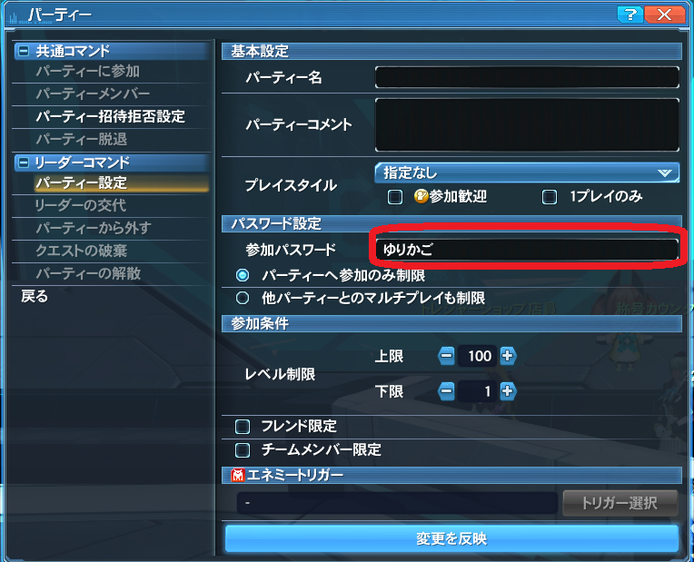
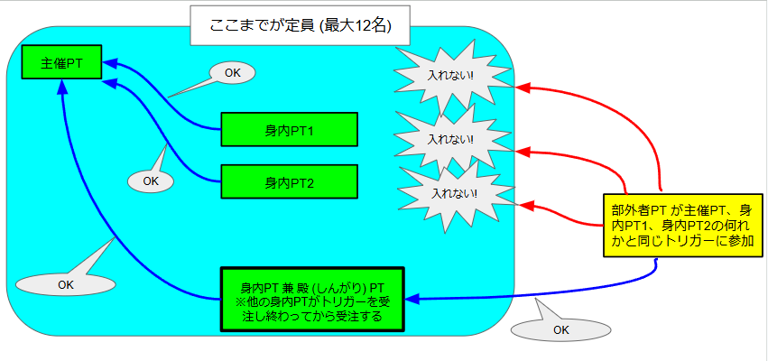
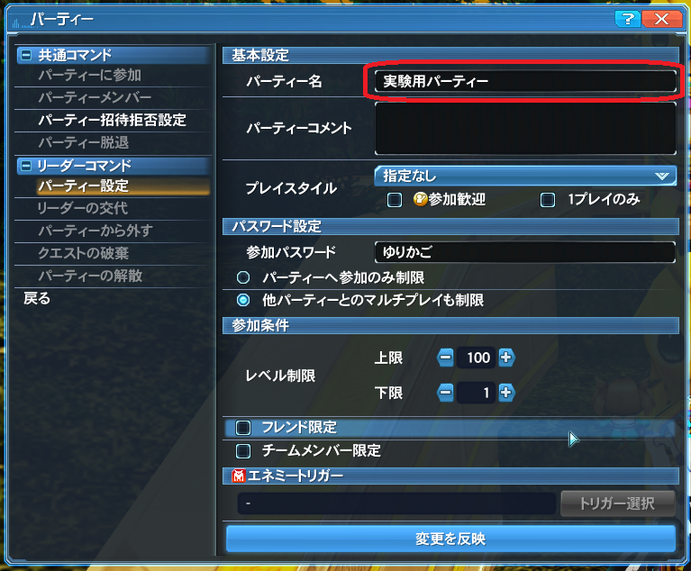

# 半固定ゆりかごTを実現する方法の例

## 0. 目次

## 1. 概要

> 親しい人たちとゆりかごTに行きたい。
>
> でも、野良募集はたくさん人が集まるから、入れなくて困る。
>
> じゃあ、自分でトリガーを用意して、固定メンバーでやろうか。
>
> でも固定メンバーだけだと人数が足りない。
>
> じゃあ、足りない分は野良募集する半固定にしよう。

…と考える人は結構いると思います。

でもそういう野良募集を見かけることはあまりありません。
多分ですが、半固定トリガーの編成がかなり面倒なのがその大きな要因のひとつだと思います。

本ドキュメントでは、半固定トリガーを編成する際の問題点と、その解決策の例について解説します。

前もって書いておきますが、**本ドキュメントで説明する例でもかなりの面倒さは残ります** ので、実用的かどうかは疑問が残るところです。

## 2. 本ドキュメントが対象とする読者

本ドキュメントは、以下のような読者を対象にしています。

- PSO2 で野良トリガーの主催経験がある方

## 3. 固定トリガーと参加パスワードの仕様 (おさらい)

まず、完全な固定トリガー (野良募集をせず仲間内のPTだけで実施するトリガー) の編成方法のおさらいから始めます。
この辺の仕様を既にご存じの方は読み飛ばして
[4. 半固定トリガーをどのように実現するか](#4-%E5%8D%8A%E5%9B%BA%E5%AE%9A%E3%83%88%E3%83%AA%E3%82%AC%E3%83%BC%E3%82%92%E3%81%A9%E3%81%AE%E3%82%88%E3%81%86%E3%81%AB%E5%AE%9F%E7%8F%BE%E3%81%99%E3%82%8B%E3%81%8B)
へお進みください。

とりあえず、トリガーを貼るPT (主催PT) と、主催が参加させたいPT (身内PT) がいくつかあり、それ以外の部外者のPTはシャットアウトしたい、という状況を考えます。

|  |
|:--|
 
固定PTを組むためには、主催PTのパーティー設定画面で参加パスワードを設定します。(俗に言う **「鍵をかける」** というやつです)

|  |
|:--|

参加パスワードを設定することにより、主催PTへ参加しようとすると以下のような画面が表示され、パスワードを知らない部外者は主催PTへ参加できなくなります。

|  |
|:--|

> [!NOTE]
> ちなみに、鍵を外すには、以下のように参加パスワードの項目を消去します。
>
> |  |
> |:--|

 

これで部外者の参加をシャットアウトできるでしょうか？

いいえ、これだけでは不十分です。

**「パーティーへの参加のみ制限」** が指定されているので、これでシャットアウトできるのは、主催PTそのものへの参加だけです。

部外者がパーティーの一覧から主催PTを選んで、**「別のパーティーとして参加」** を選択すると、そのパーティーが参加しているトリガー (つまりゆりかごT) に参加できてしまいます。

|  |
|:--|

その結果として、部外者のPTがトリガーを受注するタイミングによっては、以下のように、ゆりかごTの12人の枠内に身内PTが入れない可能性があります。

|  |
|:--|

 

部外者が主催PTと同じトリガーに参加できないようにするためには、主催PTのパーティー設定画面で **「他パーティーとのマルチプレイも制限」** を指定する必要があります。

|  |
|:--|

この設定をすることにより、主催PTと同じトリガーに参加しようとすると、やはりパスワード入力画面が表示され、パスワードを知らない限りトリガーに参加できなくなります。

 

では、今度こそ部外者の参加をシャットアウトできるでしょうか？

いいえ、残念ながらそれでも不十分です。

主催PTで設定した **「他パーティーとのマルチプレイも制限」** の指定は、あくまでも「**主催PTと同じトリガーへの参加** にはパスワードが必要となる」指定であって、以下のように、 部外者PTが**主催PT以外の身内PTと同じトリガーに参加** しようとする分には何ら障害とはなりません。

|  |
|:--|

この問題への完全な対処方法は、 **(パーティーを組んでいる人もソロの人も含めて) 主催PTと身内全員がパーティー設定画面で (参加パスワードを設定した上で) 「他パーティーとのマルチプレイも制限」を指定する** ことです。

|  |
|:--|

この場合、主催PTのパーティー設定画面で設定するパスワードと、各身内PTのパーティー設定画面で設定するパスワードは、(ややこしいことに) 必ずしも一致する必要はありません。しかし、混乱を避けるために参加パスワードは統一しておくのが無難でしょう。

## 4. 半固定トリガーをどのように実現するか

PSO2でのトリガーへの鍵かけの仕組みを再確認したところで、改めて半固定トリガーをどのように実現するかを考えてみます。

### 4.1 アプローチその1) 固定トリガーを組んだ後で鍵を外す

この方法は手順としては簡単です。

1) 主催PTが鍵をかけた上でトリガーを貼る。(このとき鍵もかける)
2) 主催PTが貼ったトリガーを身内PTが受注する。(このとき鍵もかける)
3) **主催PTとすべての身内PTが参加できたことを確認した上で**、主催PTと身内PTの鍵を外す。
4) 参加希望者に白チャで準備ができたことを広報する。
5) 一般参加者のPTが (主催PTあるいはいずれかの身内PTの別パーティーとして) トリガーを受注する。

一見これで問題なさそうに見えます。過去にこの手順を実験的に実施した知人がいましたが、特に大きな問題は発生しませんでした。少なくとも外見上は。

この方法で問題となるのは以下の点です。

#### 問題点) 主催者と各身内PTのリーダーの負担が大きい

まず、「鍵をかけたり」「外したり」を、トリガーを貼る度にやらなければならないのが大変です。

完全な固定トリガーの場合は、各PTのパーティー設定画面で鍵をかける設定をしたらその後はパーティー設定画面をいじる必要はありません。
しかし、「鍵を外す」という手順が含まれているため、主催者を含めて固定メンバーのパーティーリーダーたちは、トリガーを貼る度にパーティー設定画面で鍵をかける設定をし直さなければなりません。

この負担は「トリガーを貼ってから一般参加者が参加可能になるまでのタイムラグ」にも反映されてしまうわけで、その分一般参加者を待たせることになります。
過去に実施した事例では、30秒～1分程度は余分にかかっていた記憶があります。

### 4.2 アプローチ2) 一般参加者に開放するPTを1つだけ設ける

「パーティー設定を何度もいじらずに済む方法はないか」という方向で考えたのがこの方法です。ちなみにこの方法はまだ実施した実績がありません。

#### 4.2.1 概要

固定メンバーのPTのうち、身内PTの1つを **「殿 (しんがり) PT」** と呼称し、一般参加者へは殿PTへの「別のパーティーとして参加」だけをできるようにするものとします。

|  |
|:--|

手順は以下の通りです。

1) 主催PTが鍵をかけた上でトリガーを貼る。このとき、参加パスワードと同時に **「他パーティーとのマルチプレイも制限」** も設定する。
2) 殿PT以外の身内PTの場合) 主催PTが貼ったトリガーを受注する。このとき、参加パスワードと同時に **「他パーティーとのマルチプレイも制限」** も設定する。
3) 殿PTの場合) **殿PT以外のすべての身内PTがトリガーを受注したのを確認してから** 殿PTもトリガーを受注する。このとき、参加パスワードと同時に **「パーティーへの参加のみ制限」** も設定する。
4) 一般参加者のPTが (殿PTの別パーティーとして) トリガーを受注する。

#### 4.2.2 よりスムーズに進行するために

前述の方法には以下のような改善可能な点があります。

##### [一般参加者がトリガーに参加するために参照するPT (殿PT) がどれだかわかりやすくする]

前述の方法を採用する場合、一般参加者がトリガーに参加するために参照できるPTは殿PTしかありませんが、一般参加者がパーティー名一覧を見ても、クエスト名である「T:闇のゆりかご(UH)」という名前がいくつか並んでいるだけで、どれが殿PTか一般参加者にはわかりません。
どれか適当なPTを選んで参加しようしても、それが殿PTではなかった場合はパスワードを確認されてしまうので、一般参加者はイライラすることでしょう。

幸い、この問題の対処方法は容易です。

パーティー名一覧に表示される名前は、パーティーの設定で変更できます。例えば以下のような具合です。

|  |
|:--|

このようにパーティー名を変更すると、パーティー名一覧には以下のように表示されます。

|  |
|:--|

これを利用して、例えば以下のようにパーティー名を設定すれば、一般参加者からはだいぶわかりやすくなる (はず) です。

- 主催PTおよび (殿PTを除く) 身内PTでは、パーティー名を ``※関係者専用※`` などとしておく。
- 殿PTでは、パーティー名を ``ゆりかごT入口 別PTとして参加`` などとしておく。

##### [殿PTの役割分担をして一般参加者がトリガーに参加可能になるまでの時間を短縮する]

通常の野良トリガーと比べて、

