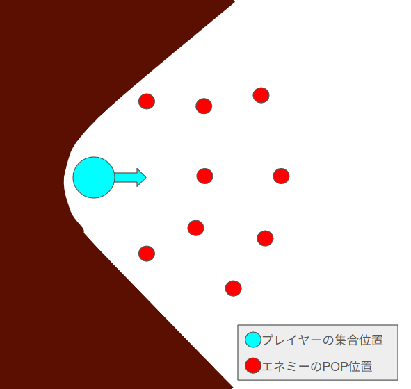
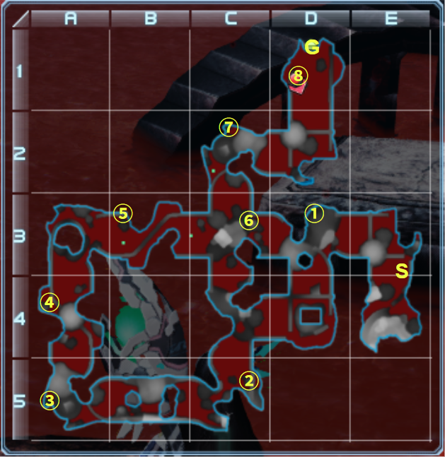
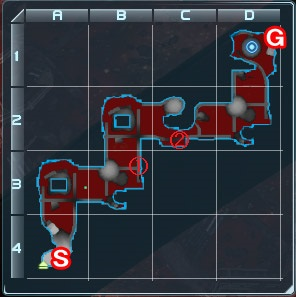

# ゆりかごTの基本的な動き方 (参加者向け)

## 0. 目次

- [1. 概要](#1-概要)
- [2. 対象とする読者](#2-対象とする読者)
- [3. ゆりかごTで優先しなければならないこと](#3-ゆりかごTで優先しなければならないこと)
- [4. 攻略中の注意点](#4-攻略中の注意点)
  - [4.1 移動中、先頭は突出せず最後尾から余り離れないようにしよう](#41-移動中先頭は突出せず最後尾から余り離れないようにしよう)
  - [4.2 PSEバーストが始まったらするべきこと](#42-PSEバーストが始まったらするべきこと)
    - [4.2.1 まずは一か所に集合する](#421-まずは一か所に集合する)
    - [4.2.2 エネミーをひたすら倒す](#422-エネミーをひたすら倒す)
  - [4.3 ボス戦でも雑魚を優先して倒しましょう](#43-ボス戦でも雑魚を優先して倒しましょう)
  - [4.4 緊急ゆりかごとの違い](#44-緊急ゆりかごとの違い)
- [5. 参考資料](#5-参考資料)

## 1. 概要

野良ゆりかごTには本当に様々な方が参加されます。レアドロップ目的の方もおられれば、経験値目的の方もおられます。

何より、参加が早い者勝ちであるため、参加者の入れ替わりは激しいですし、主催の理想通りの編成とはならないことがしばしばです。

そのような状況では最高効率を求めるのは当然無理がありますが、ゆりかごTの主催として **「せめて参加者の皆さんにはここまでは知っておいていただきたい」** という知識がいくつかあります。

筆者は、本ドキュメント執筆時点で旧PSO2プレイ歴が (実質) 約10か月、ゆりかごT主催歴が約5か月の若輩者ではありますが、そのような知識を本ドキュメントにまとめてみました。どなたかのお役に立てば幸いです。

## 2. 対象とする読者

本ドキュメントは以下の読者を対象としています。

- ゆりかごTの参加経験がある方、または
- ゆりかごTへ参加しようと考えておられる方

## 3. ゆりかごTで優先しなければならないこと

筆者が把握している限りでは、大半のゆりかごTの参加者の目的は**レアドロップ**あるいは**経験値**です。

(緊急でもそうですが) ゆりかごTには**PSEバーストが非常に発生しやすい**という特徴があり、PSEバースト中は雑魚エネミーが大量にPOPしますので、これらを倒せば非常に多くのレアドロップや経験値を取得できます。

> [!TIP]
> 極端な話、闇のゆりかごの制限時間は30分間で、それまでにクリアできなかった場合はクエストとしては失敗となりますが、PSEバーストがあまりにも続いたためにクエストが失敗しても、主催としては大成功と考えます。

ただ、PSEバーストの発生にはランダム要素が絡んでおり、意図的に発生させるのは非常に困難です。ただ、どういう状況でPSEバーストが発生しやすいか、あるいは発生しにくいかはある程度知られています。

つまり、ゆりかごTでしなければならないことは以下の2点になります。

- たくさんの雑魚エネミーを倒す
- PSEバーストの発生を妨げる行動はしない

## 4. 攻略中の注意点

前述の事柄を踏まえて、攻略中の行動について説明します。

### 4.1 移動中、先頭は突出せず最後尾から余り離れないようにしよう

雑魚エネミーを倒しながらの移動中に、やたら先頭に突出する方がよくおられます。
特に、エリア1のEトライアル「ゲル・ブルフを迎撃せよ!」の発生地点から、ベイゼのある地点 (最初のボスのゼッシュレイダがPOPする地点) の一つ手前のEトライアル「ダーカー討伐」の発生地点にかけて、それが顕著なようです。

先頭の方は「最後尾は何をもたもたしてるんだろう。さっさとついて来ればいいのに。」と考えておられるのかもしれませんが、大抵の場合は最後尾の方々は先頭の方々が討ち漏らした雑魚エネミーを掃討していることが多いです。

[4.4 緊急ゆりかごとの違い](#44-緊急ゆりかごとの違い) でも述べますが、緊急であればいざ知らず、トリガーでは雑魚エネミーを放置してまで攻略を急ぐ理由はありません。レーダーマップをよく見て他のプレイヤーやエネミーの位置を確認しつつ、着実にエネミーを倒しながら進みましょう。

何故、先頭と最後尾が離れない方がいい (つまり、まとまって行動した方がいい) かというと、その理由は、**いざPSEバーストが発生した時に集合に時間がかかってその分雑魚エネミーを倒す時間が減る**からです。

実際、PSEバーストの時間は (ワンモアやクロスバーストがなければ) 1分間しかないのに集合に30秒もかかってしまった、という事例が山ほどあります。
筆者はこういうのは非常にもったいないと思うのです。

### 4.2 PSEバーストが始まったらするべきこと

#### 4.2.1 まずは一か所に集合する

多くのゆりかごT主催者が参加者への最優先の注意事項として挙げるのは、**「PSEバーストが発生したら一か所にまとまる」** ことです。

NGSではPSEバーストが発生するとエネミーはある固定地点の周囲にPOPしますが、**旧PSO2では「各プレイヤーの周囲」にPOPします。**

プレイヤーが一か所にまとまっていれば雑魚エネミーの再POP場所もある程度絞り切れますので、フォースの「レ・ザンディア」などで雑魚エネミーを吸引してまとめて、そこを狙って他のプレイヤーも範囲攻撃スキルを当てる、というのがセオリーです。

逆に、プレイヤーが散らばっていると、雑魚エネミーの再POP場所もそれに応じて散らばりますので、雑魚エネミーの殲滅効率は大幅に低下します。

ですので、PSEバーストが発生したら一か所にまとまることは非常に重要です。

 

では、どこにまとまればいいかというと、どこでもいいわけではありません。PSEバーストを迎え撃つのに向いた地形とそうではない地形があります。

周囲に障害物がない場所に集まると、雑魚エネミーは集まった場所の前後左右全方位のどこかに再POPしてしまいますが、例えば壁のすぐそばに集まれば当然壁の位置には再POPしませんので、再POP位置を絞り込むことが出来て、より効率的に範囲攻撃を当てることが出来ます。

一番いいのは袋小路 (つまり左右と後方が壁) の場所で迎え撃つことで、そうすれば前方に攻撃を集中できますが、ゆりかごでは残念ながらそんな場所はありませんので、せめて、以下の図のように壁がへこんでいる場所を選ぶべきです。

  

筆者の鯖でよく使われている集合場所を以下に示します。`S`と`G`はそれぞれエリアの開始位置と終了位置、`1`～`8`は集合位置です。

---

> **エリア 1 の集合場所:**
> 
> 

---

> **エリア 2 の集合場所:**
> 
> 

---

エリア 1 の 2 と 4 の地点は、障害物があるためエネミーを集めにくいですが、付近にましな場所が他にないので仕方がありません。

#### 4.2.2 エネミーをひたすら倒す

集合位置に到着したら、エネミーをひたすら倒します。

基本的なセオリーとしては、Foのプレイヤーがレ・ザンディアでエネミーを集めつつ範囲ダメージを与え、他のクラスのプレイヤーがそこに向かって範囲攻撃などを駆使してエネミーを倒しまくる、というのが一般的です。他のプレイヤーへのバフを撒いてくれるありがたいですね。

また、フォトンブラストが**ユリウス・ニフタ**であれば、フォトンブラストを使用することにより、より広範囲のエネミーを集めて継続ダメージを与えることが出来ます。

 

あと、**範囲攻撃を重ねて当てて時間当たりの殲滅数を増やすこと**は大事です。
エネミーは倒したら倒した分だけ再POPしますので、必ずしも見えているエネミーをすべて倒さなければならないわけではありません。

「あれ？ 何か自分だけ別の場所攻撃してない？」と思ったら、周囲を見回して他のプレイヤーの攻撃場所と合わせましょう。

> [!TIP]
> ただし、適切な範囲攻撃手段がない場合は、範囲攻撃が届いてない遠くのエネミーを狙い撃ちするのも手だと思います。る

> [!WARNING]
> エネミーを集めるという目的の都合上、それを阻害するようなスキルは使用しない方がいいでしょう。例えば、エネミーをフリーズさせたり、離れた場所にバインドさせたりです。

### 4.3 ボス戦でも雑魚を優先して倒しましょう

ボス戦の最中も雑魚はPOPし続けます。それらを倒しているうちにPSEバーストが発生することも珍しくはありませんので、ボスには最小限の人数だけ残して雑魚を優先して倒すべきです。

雑魚がまだ残っていると次の雑魚集団がPOPしない、という性質があるようなので、雑魚がもうPOPしなくなったように見えてもボスの影に隠れて残ったりしていないか念のため探してみましょう。

> [!TIP]
> ただし、**グワナーダ** (エリア 2 のアリジゴクみたいなやつ) だけは例外で、グワナーダを最後に残してしまうと、地面に潜ったりするので倒すのに時間がかかってしまいます。
> グワナーダは速攻で倒してしまってもいいでしょう。

### 4.4 緊急ゆりかごとの違い

緊急のゆりかごでは短時間でのクリアを目指す人が多いようです。

多分その理由は、受注可能な時間が30分間という制約があるために、「起こるかどうかわからないPSEバーストを期待して雑魚をちまちま倒すよりも、周回数を増やした方が収入が高いんじゃない？」と考える人が相当数いるからではないか、と筆者は考えています。

それはそれで間違いではないとは思うのですが、トリガーのゆりかごの場合はそういった制限はないので、安心して雑魚を倒しましょう。

## 5. 参考資料

- [PSE - PSO2 ファンタシースターオンライン2 攻略 Wiki](https://pso2.swiki.jp/index.php?PSE)
- [PSEバーストを効率化させよう - 【PSO2】PSEバースト完全攻略バイブル【効率化】](https://baskmedia.jp/pseburst/#index_id7)
